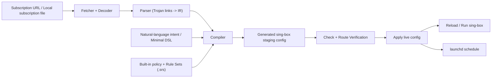
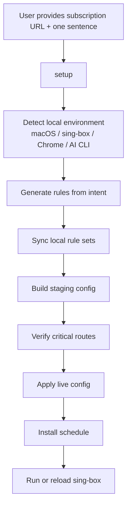

# Singbox IaC

[简体中文](./README.md)

[](https://github.com/menlong999/singbox-iac/actions/workflows/ci.yml)
[](https://www.npmjs.com/package/@singbox-iac/cli)
[](https://github.com/menlong999/singbox-iac/blob/main/LICENSE)

Policy-first subscription compiler for `sing-box` on macOS.

`Singbox IaC` treats provider subscriptions as node input instead of final configuration. It combines those inputs with fixed route policy, rule sets, and user intent to generate verifiable, publishable, and schedulable `sing-box` configs.

## Overview

This is a developer-focused proxy infrastructure CLI. It is not just an “import subscription” tool. It connects subscriptions, rules, verification, publishing, and scheduling into one controllable workflow.

Core ideas:

- subscriptions provide nodes
- policy defines routing
- generated configs must be verifiable
- process-aware routing and site-aware routing are first-class workflows

## Why This Exists

Many macOS users rely on GUI clients like Clash Verge, upstream subscriptions, global JavaScript merge scripts, Proxifier, and ad-hoc rule groups. That stack can work, but it has several recurring problems:

- provider groups are too coarse for real developer workflows
- GUI merge behavior and script patching are opaque
- route priority can drift when the upstream subscription changes
- some AI IDEs and desktop tools do not respect the normal system proxy path
- TUN or global mode can slow down unrelated local browsing
- GUI shells consume more resources than a headless proxy runtime should

`Singbox IaC` compresses that problem into:

`subscription -> parse -> compile -> verify -> apply -> schedule`

## Architecture



The system has three layers:

- input layer: subscriptions, rule sets, and user intent
- compile layer: parser, compiler, and policy assembly
- runtime layer: validation, publish, reload, and schedule

## User Journey



Typical developer path:

1. paste the subscription URL
2. describe routing needs in one sentence
3. let the tool generate config and verify key routes
4. use Proxifier for process-aware apps and the normal proxy listener for browsers
5. let `launchd` keep the config updated

## Core Capabilities

### 1. Natural-language authoring

You can describe routing goals in plain language instead of editing raw `sing-box` JSON:

- `GitHub and other dev sites should use Hong Kong`
- `Antigravity process traffic should use the US`
- `Gemini should use Singapore`
- `Apple TV and Netflix should use Singapore`

The tool compiles those intents into internal rules and then into a `sing-box` config.

### 2. Minimal DSL

For advanced users, a small YAML DSL still exists for fine-grained exceptions instead of forcing them to edit a full `sing-box` JSON file.

Good fits:

- one domain must use `AI-Out`
- one inbound must always use a specific group
- one site must stay direct
- one port should be rejected

### 3. Process-aware routing

This is one of the most important features for developer workflows.

Some AI IDEs, language servers, or desktop tools do not obey the normal system proxy path. `Singbox IaC` provides a dedicated `in-proxifier` listener so Proxifier can force selected processes into an isolated path and then pin them to a specific outbound group or leaf node.

Typical use cases:

- `Antigravity`
- Cursor
- AI IDEs or language servers
- desktop apps that do not respect system proxy settings

This lets you keep those apps on a dedicated ingress and egress path without letting general site-based routing split them apart.

### 4. Site-aware routing

The other common need is service-level routing:

- `GitHub`, Google services, and dev sites through Hong Kong or Singapore
- `Gemini`, `OpenAI`, and `Anthropic` through different AI egress groups
- `Google Stitch` through a dedicated country-specific egress
- China IPs and domains direct
- video sites like `Netflix`, `YouTube`, `Amazon Prime`, and `Apple TV` split by region

## What It Does

- Fetch Base64 Trojan subscriptions and parse share links
- Compile deterministic `sing-box` configs with fixed route priority
- Provide separate listeners for regular proxy traffic and Proxifier traffic
- Verify routes with real `sing-box` and headless Chrome
- Generate rules from one natural-language sentence
- Sync local `.srs` rule sets automatically
- Publish validated configs to `~/.config/sing-box/config.json`
- Install `launchd` schedules for recurring updates on macOS

## Install

Install `sing-box` first so the `sing-box` binary is available in your `PATH`.

Official docs:

- [sing-box package manager docs](https://sing-box.sagernet.org/installation/package-manager/)

Then install this CLI:

```bash
npm install -g @singbox-iac/cli
singbox-iac --help
```

## Quick Start

### One-step onboarding

```bash
singbox-iac setup \
  --subscription-url 'your subscription URL' \
  --prompt 'GitHub and developer sites go through Hong Kong, Antigravity process traffic goes through the US, Gemini goes through Singapore, update every 30 minutes'
```

`setup` will:

- create `~/.config/singbox-iac/builder.config.yaml`
- create `~/.config/singbox-iac/rules/custom.rules.yaml`
- check local environment readiness
- download default local `.srs` rule sets
- turn one sentence into routing rules
- build `~/.config/singbox-iac/generated/config.staging.json`

For a more guided first-run path:

```bash
singbox-iac setup \
  --subscription-url 'your subscription URL' \
  --prompt 'GitHub and developer sites go through Hong Kong, Antigravity process traffic goes through the US, Gemini goes through Singapore, update every 30 minutes' \
  --ready
```

`--ready` additionally performs:

- route verification
- live config publish
- recurring schedule installation

### Manual foreground run

```bash
singbox-iac run
```

Default local listeners:

- `127.0.0.1:39097` for browser/system proxy traffic
- `127.0.0.1:39091` for Proxifier process traffic

### Day-to-day usage

```bash
singbox-iac update --reload
```

That command performs:

- fetch
- build
- verify
- apply
- optional reload

### Background schedule

```bash
singbox-iac schedule install
```

## Natural-Language Authoring

For common cases, you do not need to learn raw `sing-box` JSON or even the DSL.

Examples:

```bash
singbox-iac author \
  --prompt 'GitHub and dev sites should use Hong Kong, Antigravity process traffic should use a dedicated US path, Gemini should use Singapore'
```

```bash
singbox-iac author \
  --prompt 'Google services and GitHub use Hong Kong, Amazon Prime and Apple TV use Singapore, China traffic stays direct, update every 45 minutes' \
  --update
```

The authoring layer supports:

- deterministic local intent parsing by default
- optional local AI CLI integration
- preview before writing
- closed-loop update after rule generation

## How It Works With sing-box

This project does not replace the `sing-box` core binary. It generates and manages `sing-box` configuration.

Typical flow:

1. fetch subscription
2. parse nodes
3. compile staging config
4. validate the config
5. verify critical routes
6. publish to the live config path
7. reload or start `sing-box`

Default live config path:

```text
~/.config/sing-box/config.json
```

## Security

This project is designed to keep sensitive inputs local by default:

- your subscription URL is stored only in the local builder config
- generated configs are written to your local config directory
- natural-language authoring defaults to a deterministic local parser
- local AI CLI integration is optional
- the repository ignores local tokens, caches, generated configs, and `.env` files

The project does not automatically upload subscription URLs to any remote service. Unless you explicitly configure an external AI CLI or external command, the default authoring path does not depend on an external API.

## Common Commands

```bash
singbox-iac init
singbox-iac setup
singbox-iac author
singbox-iac build
singbox-iac check
singbox-iac apply
singbox-iac run
singbox-iac verify
singbox-iac update
singbox-iac doctor
singbox-iac schedule install
singbox-iac schedule remove
singbox-iac templates list
```

## Project Structure

- [rules-dsl.md](./docs/rules-dsl.md)
- [rule-templates.md](./docs/rule-templates.md)
- [natural-language-authoring.md](./docs/natural-language-authoring.md)
- [runtime-on-macos.md](./docs/runtime-on-macos.md)
- [openspec/project.md](./openspec/project.md)

## Current Status

The project is already a usable MVP-plus CLI:

- real subscription ingestion works
- real route verification works
- real publish flow works
- natural-language authoring works
- the npm package is published
- macOS `launchd` integration is available

High-value next steps:

- support more protocols beyond Trojan
- expand natural-language coverage
- add more provider presets for local AI CLIs
- make first-run onboarding feel even closer to true one-command usage

## Contributing

Contributions are welcome. See [CONTRIBUTING.md](./CONTRIBUTING.md).

Especially welcome:

- new developer scenario templates
- compatibility samples from more subscription providers
- improved natural-language intent coverage
- new verification scenarios

## License

[MIT](./LICENSE)
