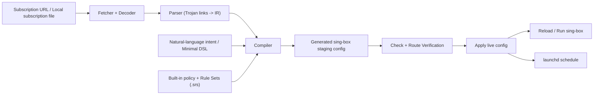
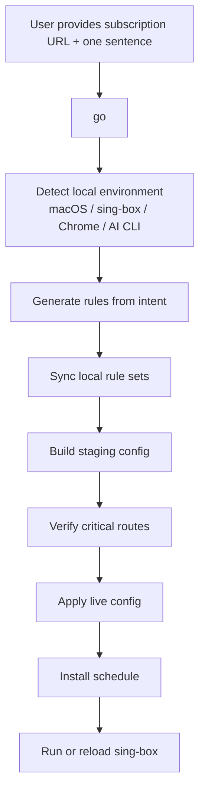

# Singbox IaC

[简体中文](./README.md)

[](https://github.com/menlong999/singbox-iac/actions/workflows/ci.yml)
[](https://www.npmjs.com/package/@singbox-iac/cli)
[](https://github.com/menlong999/singbox-iac/blob/main/LICENSE)

Policy-first subscription compiler for `sing-box` on macOS.

`Singbox IaC` treats provider subscriptions as node input instead of final configuration. It combines those inputs with fixed route policy, rule sets, and user intent to generate verifiable, publishable, and schedulable `sing-box` configs.

## Overview

This is a developer-focused proxy infrastructure CLI. It is not just an “import subscription” tool. It connects subscriptions, rules, verification, publishing, and scheduling into one controllable workflow.

Core ideas:

- subscriptions provide nodes
- policy defines routing
- generated configs must be verifiable
- process-aware routing and site-aware routing are first-class workflows

## Why This Exists

Many macOS users rely on GUI clients like Clash Verge, upstream subscriptions, global JavaScript merge scripts, Proxifier, and ad-hoc rule groups. That stack can work, but it has several recurring problems:

- provider groups are too coarse for real developer workflows
- GUI merge behavior and script patching are opaque
- route priority can drift when the upstream subscription changes
- some AI IDEs and desktop tools do not respect the normal system proxy path
- TUN or global mode can slow down unrelated local browsing
- GUI shells consume more resources than a headless proxy runtime should

`Singbox IaC` compresses that problem into:

`subscription -> intent -> DNS / verification planning -> compile -> verify -> apply -> runtime / schedule`

## Architecture



The system has three layers:

- input layer: subscriptions, rule sets, and user intent
- compile layer: parser, compiler, and policy assembly
- runtime layer: validation, publish, reload, and schedule

## User Journey



Typical developer path:

1. paste the subscription URL
2. describe routing needs in one sentence
3. let the tool generate config and verify key routes
4. use Proxifier for process-aware apps and the normal proxy listener for browsers
5. let `launchd` keep the config updated

## Core Capabilities

### 1. Natural-language authoring

You can describe routing goals in plain language instead of editing raw `sing-box` JSON:

- `GitHub and other dev sites should use Hong Kong`
- `Antigravity process traffic should use the US`
- `Gemini should use Singapore`
- `Apple TV and Netflix should use Singapore`

The tool compiles those intents into internal rules and then into a `sing-box` config.

There is now a maintained bundle-discovery layer:

- site bundles
  - for example `NotebookLM`, `Gemini`, `OpenRouter`, and `Google Stitch`
- process bundles
  - for example `Antigravity`, `Cursor`, `VS Code`, and `Codex`

Site bundles use a dual-track model:

- prefer official `sing-geosite` rule-set tags that are already enabled in the current config
- fall back to curated domains when upstream has no suitable tag or the current config has not enabled it yet

Process bundles keep stable metadata for `Proxifier` and `in-proxifier` process matching.

In most cases that means you do not need to remember related domains, official geosite tags, or helper process names yourself.

### 2. Minimal DSL

For advanced users, a small YAML DSL still exists for fine-grained exceptions instead of forcing them to edit a full `sing-box` JSON file.

Good fits:

- one domain must use `AI-Out`
- one inbound must always use a specific group
- one site must stay direct
- one port should be rejected

### 3. Process-aware routing

This is one of the most important features for developer workflows.

Some AI IDEs, language servers, or desktop tools do not obey the normal system proxy path. `Singbox IaC` provides a dedicated `in-proxifier` listener so Proxifier can force selected processes into an isolated path and then pin them to a specific outbound group or leaf node.

Typical use cases:

- `Antigravity`
- Cursor
- AI IDEs or language servers
- desktop apps that do not respect system proxy settings

This lets you keep those apps on a dedicated ingress and egress path without letting general site-based routing split them apart.

### 4. Site-aware routing

The other common need is service-level routing:

- `GitHub`, Google services, and dev sites through Hong Kong or Singapore
- `Gemini`, `OpenAI`, and `Anthropic` through different AI egress groups
- `Google Stitch` through a dedicated country-specific egress
- China IPs and domains direct
- video sites like `Netflix`, `YouTube`, `Amazon Prime`, and `Apple TV` split by region

## What It Does

- Fetch Base64 Trojan subscriptions and parse share links
- Compile deterministic `sing-box` configs with fixed route priority
- Provide separate listeners for regular proxy traffic and Proxifier traffic
- Verify routes with real `sing-box` and headless Chrome
- Generate rules from one natural-language sentence
- Sync local `.srs` rule sets automatically
- Publish validated configs to `~/.config/sing-box/config.json`
- Install `launchd` schedules for recurring updates on macOS
- Use an internal `RuntimeMode` planning layer to keep browser-proxy, process-proxy, and headless update defaults consistent

## Install

Install `sing-box` first so the `sing-box` binary is available in your `PATH`.

Official docs:

- [sing-box package manager docs](https://sing-box.sagernet.org/installation/package-manager/)

Then install this CLI:

```bash
npm install -g @singbox-iac/cli
singbox-iac --help
```

After the first successful `go`, `setup`, or `doctor` run, the CLI persists the resolved `sing-box` and Chrome paths into your `builder.config.yaml`. Later `update` runs and the `launchd` schedule no longer depend on your current shell `PATH`.

## Quick Start

### Most users only need 3 commands

```bash
singbox-iac go '<subscription-url>' '<one-sentence intent>'
singbox-iac use '<new routing sentence>'
singbox-iac update
```

- `go`: first-time onboarding in one command
- `use`: change policy later with one sentence and re-apply it
- `update`: refresh the subscription and apply the latest config

`use` defaults to patch semantics. It preserves unrelated previously authored intent unless you explicitly pass `--replace`.

For desktop runtime and troubleshooting, the most useful commands are:

```bash
singbox-iac start
singbox-iac stop
singbox-iac restart
singbox-iac status
singbox-iac diagnose
```

- `start`: start the desktop runtime as a dedicated macOS LaunchAgent
- `stop`: stop the desktop runtime and let `sing-box` release system proxy or TUN resources
- `restart`: restart the desktop runtime
- `status`: summarize live config, desktop runtime, system proxy/TUN state, schedule, and the latest transaction
- `diagnose`: extend `status` with default route, system DNS, and representative DNS evidence when you need to understand why the network is still wrong

For troubleshooting, start with:

```bash
singbox-iac status
singbox-iac diagnose
```

`status` is the compact runtime snapshot. `diagnose` is the heavier triage command when you need to separate runtime drift from local DNS or default-route problems.

Everything else can be treated as advanced commands for debugging or fine-grained control.

For example:

```bash
singbox-iac rulesets list --filter openai
```

That hidden command shows:

- which `ruleSet` tags are enabled in the current builder config
- which upstream `sing-geosite` and `sing-geoip` tags are available
- which built-in site bundles prefer official tags and which still fall back to curated domains

`RuntimeMode` is an internal concept; users do not need to choose one manually. Onboarding and `update` infer `browser-proxy`, `process-proxy`, or `headless-daemon` and use that to guide visible verification and runtime defaults. See [docs/runtime-modes.md](./docs/runtime-modes.md).

### Default first-run path

```bash
singbox-iac go \
  'your subscription URL' \
  'GitHub and developer sites go through Hong Kong, Antigravity process traffic goes through the US, Gemini goes through Singapore, update every 30 minutes'
```

`go` will:

- create `~/.config/singbox-iac/builder.config.yaml`
- create `~/.config/singbox-iac/rules/custom.rules.yaml`
- create `~/.config/singbox-iac/proxifier/` helper files
- check local environment readiness
- use bundled default `.srs` rule sets and only sync extras when needed
- turn one sentence into routing rules
- build `~/.config/singbox-iac/generated/config.staging.json`
- verify critical routes
- publish the live config
- install the recurring schedule

If you want the more explicit onboarding command, you can still use:

```bash
singbox-iac setup \
  --subscription-url 'your subscription URL' \
  --prompt 'GitHub and developer sites go through Hong Kong, Antigravity process traffic goes through the US, Gemini goes through Singapore, update every 30 minutes' \
  --ready
```

The difference is simple:

- `go` is the shortest recommended first-run path
- `setup --ready` is better if you still want to control run/browser/Proxifier flags yourself

### Manual foreground run

```bash
singbox-iac run
```

If you want a more GUI-like always-on desktop runtime, prefer:

```bash
singbox-iac start
```

The default desktop runtime profiles are:

- `system-proxy`: keep the `mixed` inbound and let `sing-box` set / clean macOS system proxy automatically
- `tun`: emit a `tun` inbound with `auto_route`, closer to the global-capture behavior of GUI clients

If onboarding intent explicitly mentions `TUN`, `global proxy`, or similar wording, the desktop profile is inferred as `tun`. Otherwise the default profile is `system-proxy`.

Default local listeners:

- `127.0.0.1:39097` for browser/system proxy traffic
- `127.0.0.1:39091` for Proxifier process traffic

### Day-to-day usage

```bash
singbox-iac update
```

That command performs:

- fetch
- build
- verify
- apply
- reload automatically when a `sing-box` process is already running

### Background schedule

```bash
singbox-iac schedule install
```

Background updates and desktop runtime are separate concerns:

- `schedule install`: runs recurring `update`
- `start / stop / restart`: manage the local desktop runtime LaunchAgent

## Natural-Language Authoring

If you only want to change the routing sentence and apply it immediately, use the shorter command:

```bash
singbox-iac use 'GitHub and developer sites go through Hong Kong, Gemini goes through Singapore'
```

For common cases, you do not need to learn raw `sing-box` JSON or even the DSL.

`use` defaults to patch instead of replace:

- `singbox-iac use 'NotebookLM goes through the US'`
  - augments or overrides the relevant part of the current authored intent
- `singbox-iac use 'All developer traffic goes through Singapore' --replace`
  - explicitly rebuilds the authored policy set from scratch

The tool keeps two related files:

- `rules.userRulesFile`
  - the merged YAML DSL that the compiler actually consumes
- sibling `*.authoring.yaml`
  - the layered authoring state used to preserve a base intent plus later patches

Examples:

```bash
singbox-iac use 'Google services and GitHub use Hong Kong, Amazon Prime and Apple TV use Singapore, China traffic stays direct, update every 45 minutes'
```

```bash
singbox-iac use 'NotebookLM goes through the US, Cursor uses a dedicated ingress and exits through the US'
```

The authoring layer supports:

- deterministic local intent parsing by default
- optional local AI CLI integration
- `--strict` to reject vague requests instead of guessing
- `--diff` to inspect `Intent IR / rules / config` changes before writing
- `--emit-intent-ir` to print the structured intent layer directly
- closed-loop update after rule generation

Recommended before applying a production routing change:

```bash
singbox-iac use 'GitHub and developer sites go through Hong Kong, Gemini goes through Singapore' --strict --diff
```

If you explicitly want to discard the earlier natural-language policy set, use:

```bash
singbox-iac use 'Google services and GitHub use Singapore' --replace
```

If you need preview-only operation, direct `Intent IR`, or staged author/build/update control, use the power-user `author` command. See [docs/natural-language-authoring.md](./docs/natural-language-authoring.md).

## Proxifier Onboarding

If your AI IDE, language server, or desktop app does not respect the normal system proxy path, use the generated Proxifier helper directory:

```text
~/.config/singbox-iac/proxifier/
```

It contains:

- `README.md`
- `proxy-endpoint.txt`
- `custom-processes.txt`
- `bundles/antigravity.txt`
- `bundles/cursor.txt`
- `bundles/developer-ai-cli.txt`
- `bundle-specs/antigravity.yaml`
- `bundle-specs/cursor.yaml`
- `all-processes.txt`

If you only want to regenerate the Proxifier helper files:

```bash
singbox-iac proxifier scaffold --prompt 'Antigravity process traffic goes through the US and Cursor also uses a dedicated ingress'
```

You can also inspect or export declarative bundle specs directly:

```bash
singbox-iac proxifier bundles
singbox-iac proxifier bundles show antigravity
singbox-iac proxifier bundles render antigravity
```

## How It Works With sing-box

This project does not replace the `sing-box` core binary. It generates and manages `sing-box` configuration.

Typical flow:

1. fetch subscription
2. parse nodes
3. compile staging config
4. validate the config
5. verify critical routes
6. publish to the live config path
7. reload or start `sing-box`

Default live config path:

```text
~/.config/sing-box/config.json
```

## Security

This project is designed to keep sensitive inputs local by default:

- your subscription URL is stored only in the local builder config
- generated configs are written to your local config directory
- natural-language authoring defaults to a deterministic local parser
- local AI CLI integration is optional
- the repository ignores local tokens, caches, generated configs, and `.env` files

The project does not automatically upload subscription URLs to any remote service. Unless you explicitly configure an external AI CLI or external command, the default authoring path does not depend on an external API.

## Power-User / Engineering Commands

Unless you are splitting the pipeline, doing deeper diagnostics, or handling a special integration, you usually do not need these directly:

```bash
singbox-iac init
singbox-iac setup
singbox-iac author
singbox-iac build
singbox-iac check
singbox-iac apply
singbox-iac run
singbox-iac verify
singbox-iac proxifier bundles
singbox-iac proxifier bundles show antigravity
singbox-iac proxifier bundles render antigravity
singbox-iac proxifier scaffold
singbox-iac rulesets list --filter openai
singbox-iac schedule install
singbox-iac schedule remove
singbox-iac templates list
```

## Project Structure

- [rules-dsl.md](./docs/rules-dsl.md)
- [rule-templates.md](./docs/rule-templates.md)
- [natural-language-authoring.md](./docs/natural-language-authoring.md)
- [proxifier-onboarding.md](./docs/proxifier-onboarding.md)
- [runtime-on-macos.md](./docs/runtime-on-macos.md)
- [openspec/project.md](./openspec/project.md)

## Current Status

The project is already a usable MVP-plus CLI:

- real subscription ingestion works
- real route verification works
- real publish flow works
- natural-language authoring works
- the npm package is published
- macOS `launchd` integration is available

High-value next steps:

- support more protocols beyond Trojan
- expand natural-language coverage
- add more provider presets for local AI CLIs
- make first-run onboarding feel even closer to true one-command usage

## Contributing

Contributions are welcome. See [CONTRIBUTING.md](./CONTRIBUTING.md).

Especially welcome:

- new developer scenario templates
- compatibility samples from more subscription providers
- improved natural-language intent coverage
- new verification scenarios

## License

[MIT](./LICENSE)
