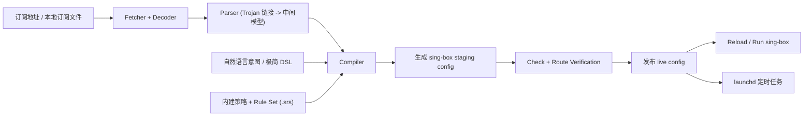
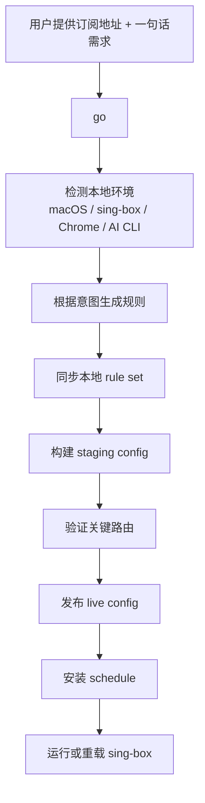

# Singbox IaC

[English](./README-en.md)

[](https://github.com/menlong999/singbox-iac/actions/workflows/ci.yml)
[](https://www.npmjs.com/package/@singbox-iac/cli)
[](https://github.com/menlong999/singbox-iac/blob/main/LICENSE)

面向 macOS 无头场景的 `sing-box` 订阅编译器。

`Singbox IaC` 把机场订阅当作节点输入，而不是最终配置本身，再结合固定路由策略、规则集和用户意图，生成可验证、可发布、可定时更新的 `sing-box` 配置。

## 项目简介

这是一个面向开发者的代理基础设施 CLI。它解决的不是“导入订阅”这个单点问题，而是把订阅、规则、验证、发布和定时更新串成一条可控链路。

核心理念：

- 订阅只负责提供节点
- 路由策略由你掌控
- 配置生成后必须可验证
- 进程级分流和站点级分流都应该是一等能力

## 为什么要做这个项目

很多用户在 macOS 上会使用 Clash Verge 一类 GUI 客户端，再配合机场订阅、全局 JS merge 脚本、Proxifier、规则分组做复杂定制。这个方案能用，但常见问题也很明显：

- 订阅分组粗糙，无法直接表达开发者真实需求
- GUI 内部合并和脚本 patch 过于黑盒
- 规则优先级容易被上游订阅变化破坏
- 某些 AI IDE 或桌面应用不走系统代理，必须依赖 Proxifier
- 开启 TUN 或全局代理后，本地其他访问可能明显变慢
- GUI 壳本身资源占用高，不适合长期无头运行

`Singbox IaC` 的目标就是把这些需求收敛成：

`subscription -> parse -> compile -> verify -> apply -> schedule`

## 架构图



系统本质上分三层：

- 输入层：订阅、规则集、用户意图
- 编译层：解析器、编译器、策略组装
- 运行层：校验、发布、重载、定时任务

## 用户旅程



典型开发者路径：

1. 填订阅地址
2. 用一句话描述需求
3. 自动生成配置并验证关键分流
4. IDE / AI 应用走 Proxifier，浏览器走普通代理入口
5. 通过 `launchd` 自动更新配置

## 核心功能

### 1. 自然语言描述

你可以直接用自然语言表达需求，而不是手写原始 `sing-box` JSON：

- `GitHub 这类开发类都走香港`
- `Antigravity 进程级走美国`
- `Gemini 走新加坡`
- `Apple TV 和 Netflix 走新加坡`

系统会把这些意图编译成内部规则，再进一步生成 `sing-box` 配置。

### 2. 极简 DSL

对于高级用户，仍然保留了一个极简 YAML DSL，用于补充少量例外规则，而不是逼用户手写整份 `sing-box` JSON。

适合的场景：

- 某个域名单独走 AI-Out
- 某个入口固定走特定组
- 某个站点强制直连
- 某个端口直接拒绝

### 3. 进程级分流

这是很多程序员不会配、但实际非常关键的一类能力。

某些 AI IDE、language server 或桌面应用并不遵守系统代理。`Singbox IaC` 提供专用的 `in-proxifier` 入口，让 Proxifier 可以把指定进程强制送进独立链路，再固定到特定出口组或叶子节点。

典型用途：

- `Antigravity`
- Cursor
- 某些 AI IDE 或 language server
- 其他不走系统代理的桌面应用

这让你可以把这些应用固定到独立入口和独立出口，而不会被普通站点规则打散。

### 4. 站点级与服务级分流

除了进程级，另一个高频需求就是站点级分流：

- `GitHub`、Google 服务、常见开发类网站走香港或新加坡
- `Gemini`、`OpenAI`、`Anthropic` 等 AI 服务走不同出口组
- `Google Stitch` 这类必须走特定国家出口的站点走专门分组
- 中国大陆域名和 IP 直连
- 视频站点如 `Netflix`、`YouTube`、`Amazon Prime`、`Apple TV` 按地区分流

## 项目能做什么

- 拉取 Base64 Trojan 订阅并解析 share links
- 编译固定优先级的 `sing-box` 配置
- 提供普通代理入口和 Proxifier 专用入口
- 用真实 `sing-box` 和无头 Chrome 做闭环验证
- 支持“一句话规则生成”
- 自动同步本地 `.srs` 规则集
- 发布配置到 `~/.config/sing-box/config.json`
- 通过 `launchd` 做定时更新
- 内部 `RuntimeMode` 规划层，用于统一浏览器代理、进程级代理和无头更新路径的默认行为

## 安装

先安装 `sing-box`，确保终端里可以直接执行 `sing-box`。

官方文档：

- [sing-box package manager docs](https://sing-box.sagernet.org/installation/package-manager/)

然后安装 CLI：

```bash
npm install -g @singbox-iac/cli
singbox-iac --help
```

第一次成功执行 `go`、`setup` 或 `doctor` 之后，CLI 会把解析到的 `sing-box` 和 Chrome 路径写回你的 `builder.config.yaml`。这样后续 `update` 和 `launchd schedule` 不会再依赖你当前 shell 的 `PATH`。

## 快速开始

### 大多数用户只需要 3 个命令

```bash
singbox-iac go '<订阅地址>' '<一句话需求>'
singbox-iac use '<新的需求描述>'
singbox-iac update
```

- `go`：第一次安装时使用，一条命令完成初始化、验证、发布和定时任务准备
- `use`：以后需求变化时使用，一句话 patch 现有策略并重新应用
- `update`：日常更新订阅并自动在运行中的 `sing-box` 上生效

`use` 默认不会清空你之前的自然语言策略。它会在现有 authored intent 之上做 patch；只有显式传 `--replace` 时，才会把 authored policy set 整体替换掉。

桌面运行和排障最常用的是：

```bash
singbox-iac start
singbox-iac stop
singbox-iac restart
singbox-iac status
singbox-iac diagnose
```

- `start`：以 macOS 专用 LaunchAgent 启动桌面运行时
- `stop`：停止桌面运行时，并让 `sing-box` 释放系统代理或 TUN 资源
- `restart`：重新拉起桌面运行时
- `status`：汇总 live config、桌面运行时、系统代理 / TUN 状态、schedule 和最近一次事务
- `diagnose`：在 `status` 之上追加默认路由、系统 DNS 和代表性域名解析证据，适合排查“为什么现在网络还是不对”

排障时优先用：

```bash
singbox-iac status
singbox-iac diagnose
```

`status` 适合看当前运行快照；`diagnose` 适合继续判断问题更像是运行时漂移、系统 DNS/默认路由异常，还是最近一次发布没有生效。

其余命令都属于 power-user / 工程命令，主要用于拆流程、排障或更细粒度控制。

`RuntimeMode` 是内部概念，不要求用户手动选择。当前 onboarding 和 `update` 会自动推断 `browser-proxy`、`process-proxy` 或 `headless-daemon`，并据此调整可见验证和运行时默认行为。详见 [docs/runtime-modes.md](./docs/runtime-modes.md)。

### 首次初始化的默认路径

```bash
singbox-iac go \
  '你的机场订阅地址' \
  'GitHub 这类开发类走香港，Antigravity 进程级走美国，Gemini 走新加坡，每30分钟自动更新'
```

`go` 会自动：

- 生成 `~/.config/singbox-iac/builder.config.yaml`
- 生成 `~/.config/singbox-iac/rules/custom.rules.yaml`
- 生成 `~/.config/singbox-iac/proxifier/` 辅助文件
- 检查本地环境
- 使用包内内置的默认 `.srs` 规则集，并在需要时补充同步
- 把一句自然语言转成路由规则
- 构建 `~/.config/singbox-iac/generated/config.staging.json`
- 验证关键路由
- 发布 live config
- 安装定时更新

如果你希望保留更细的首启控制，再使用 power-user 的 `setup --ready`：

```bash
singbox-iac setup \
  --subscription-url '你的机场订阅地址' \
  --prompt 'GitHub 这类开发类走香港，Antigravity 进程级走美国，Gemini 走新加坡，每30分钟自动更新' \
  --ready
```

### 前台运行测试

```bash
singbox-iac run
```

如果你想要更接近 GUI 的常驻体验，优先用：

```bash
singbox-iac start
```

当前默认桌面运行 profile 是：

- `system-proxy`：保留 `mixed` 入站，并让 `sing-box` 自动设置 / 清理 macOS 系统代理
- `tun`：生成 `tun` 入站并启用 `auto_route`，更接近 GUI 客户端的全局接管方式

如果自然语言里明确提到 `TUN`、`全局代理`、`全局模式` 等需求，onboarding 会把桌面 profile 推断成 `tun`。否则默认使用 `system-proxy`。

默认监听端口：

- `127.0.0.1:39097`：浏览器 / 系统代理流量
- `127.0.0.1:39091`：Proxifier 进程流量

### 日常使用

```bash
singbox-iac update
```

这条命令会执行：

- fetch
- build
- verify
- apply
- 如果检测到 `sing-box` 正在运行，则自动 reload

### 定时更新

```bash
singbox-iac schedule install
```

定时更新和桌面运行是两条独立链路：

- `schedule install`：定时执行 `update`
- `start / stop / restart`：管理本地桌面运行的 `sing-box` LaunchAgent

## 自然语言规则编写

如果你只想“改一句话需求并立即生效”，推荐直接用更短的命令：

```bash
singbox-iac use 'GitHub 这类开发类都走香港，Gemini 走新加坡'
```

对于大多数场景，不需要手写 `sing-box` JSON，也不需要理解 DSL。

`use` 的默认语义是 patch，而不是 replace：

- `singbox-iac use 'NotebookLM 走美国'`
  - 在现有 authored intent 上追加或覆盖相关策略
- `singbox-iac use '所有开发类都走新加坡' --replace`
  - 显式重建 authored policy set

内部会同时维护两类文件：

- `rules.userRulesFile`
  - 当前 compiler 真正消费的 merged YAML DSL
- 同目录下的 `*.authoring.yaml`
  - layered authored state，用来保留 base intent 和后续 patch

示例：

```bash
singbox-iac use 'Google 服务和 GitHub 走香港，Amazon Prime 和 Apple TV 走新加坡，国内直连，每45分钟自动更新'
```

作者层支持：

- 默认使用本地确定性意图解析
- 可选接入本地 AI CLI
- 支持 `--strict`，遇到模糊表述直接失败
- 支持 `--diff`，先看 `Intent IR / 规则 / 配置` 变化再决定是否应用
- 支持 `--emit-intent-ir`，直接输出结构化意图层
- 生成规则后直接闭环 update

推荐在正式改策略前先看一次 diff：

```bash
singbox-iac use 'GitHub 这类开发类都走香港，Gemini 走新加坡' --strict --diff
```

如果你明确要放弃之前的一整套自然语言策略，再使用：

```bash
singbox-iac use 'Google 服务和 GitHub 都走新加坡' --replace
```

如果你需要 preview、Intent IR、或分阶段 author/build/update 控制，再使用 power-user 的 `author`。详见 [docs/natural-language-authoring.md](./docs/natural-language-authoring.md)。

## Proxifier 上手

如果你的 AI IDE、language server 或桌面应用不走系统代理，可以直接使用自动生成的 Proxifier 辅助目录：

```text
~/.config/singbox-iac/proxifier/
```

其中会包含：

- `README.md`
- `proxy-endpoint.txt`
- `custom-processes.txt`
- `bundles/antigravity.txt`
- `bundles/cursor.txt`
- `bundles/developer-ai-cli.txt`
- `bundle-specs/antigravity.yaml`
- `bundle-specs/cursor.yaml`
- `all-processes.txt`

如果你只想重新生成这部分，不需要重跑全部 onboarding：

```bash
singbox-iac proxifier scaffold --prompt 'Antigravity 进程级走美国，Cursor 也走独立入口'
```

也可以直接查看或导出声明式 bundle：

```bash
singbox-iac proxifier bundles
singbox-iac proxifier bundles show antigravity
singbox-iac proxifier bundles render antigravity
```

## 它和 sing-box 是怎么配合的

它不会替代 `sing-box` 内核本身，而是负责生成和维护 `sing-box` 配置。

典型流程：

1. 拉取订阅
2. 解析节点
3. 编译 staging config
4. 校验配置
5. 验证关键路由
6. 发布到 live config 路径
7. 重载或启动 `sing-box`

默认 live 配置路径：

```text
~/.config/sing-box/config.json
```

## 安全性

这个项目默认尽量把敏感信息留在本地：

- 订阅地址只保存在本地 builder config 中
- 生成的配置写入你的本地配置目录
- 自然语言作者层默认使用本地确定性解析器
- 本地 AI CLI 接入是可选的，不是强制依赖
- 仓库默认忽略本地 token、缓存、生成配置和 `.env`

当前项目不会把订阅地址自动上传到任何远端服务。除非你主动配置外部 AI CLI 或外部命令，否则默认作者层不依赖外部 API。

## Power-user / 工程命令

除非你要拆开流水线、做深度排障或处理特殊集成，一般不需要直接用这些：

```bash
singbox-iac init
singbox-iac setup
singbox-iac author
singbox-iac build
singbox-iac check
singbox-iac apply
singbox-iac run
singbox-iac verify
singbox-iac proxifier bundles
singbox-iac proxifier bundles show antigravity
singbox-iac proxifier bundles render antigravity
singbox-iac proxifier scaffold
singbox-iac schedule install
singbox-iac schedule remove
singbox-iac templates list
```

## 项目结构

- [rules-dsl.md](./docs/rules-dsl.md)
- [rule-templates.md](./docs/rule-templates.md)
- [natural-language-authoring.md](./docs/natural-language-authoring.md)
- [proxifier-onboarding.md](./docs/proxifier-onboarding.md)
- [runtime-on-macos.md](./docs/runtime-on-macos.md)
- [openspec/project.md](./openspec/project.md)

## 当前状态

项目已经是一个可用的 MVP+ CLI：

- 真实订阅拉取可用
- 真实路由验证可用
- 真实发布链路可用
- 自然语言作者层可用
- npm 包已发布
- macOS `launchd` 集成可用

当前最值得继续推进的方向：

- 支持 Trojan 之外的更多协议
- 提升自然语言覆盖范围
- 增加更多本地 AI CLI provider preset
- 把首次上手继续收敛到真正的一键可用

## 参与贡献

欢迎提交 issue、PR 和场景反馈，详见 [CONTRIBUTING.md](./CONTRIBUTING.md)。

特别欢迎：

- 新的开发者场景模板
- 不同机场订阅的兼容性样本
- 自然语言规则表达改进
- 新的验证用例

## 许可证

[MIT](./LICENSE)
